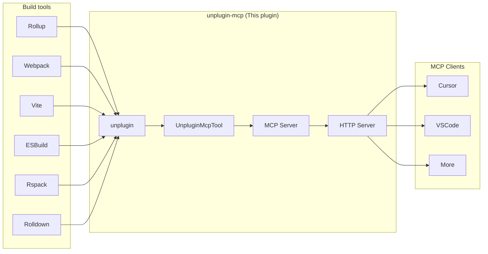

# unplugin-mcp

[](https://www.npmjs.com/package/unplugin-mcp)
[](https://www.npmjs.com/package/unplugin-mcp)


> [!IMPORTANT]
> This is a work in progress. Not ready for production use yet. If you are interested in and want to help, feel free to open an issue or PR.

A unified MCP (Model Context Protocol) plugin that creates and manages an MCP Server and provides MCP tools by which AI can know more about your codebase, build tools, and even control the build process. It works with multiple JavaScript build tools supported by unplugin, including Rollup, Vite, Webpack, and others.

Here is the vision of this plugin, to provide a unified MCP Server and MCP tools to MCP Client.



## Features

- 🚀 **Cross-Platform MCP Integration**: Creates and manages an MCP server seamlessly across multiple build tools.
- 🧩 **Bi-directional AI Integration**: Not only provides context to AI assistants about your codebase, but also enables AI to actively modify and control your build process.
- 🧰 **Rich built-in tools**: Collection of built-in tools for analyzing module dependencies, inspecting build configuration, debugging error messages, and so on.
- 🛠️ **Extensible Tool Framework**: Create custom MCP tools with the simple `UnpluginMcpTool` interface to expose project-specific information or functionality.
- 🔍 **Build Process Integration**: Seamlessly integrates at any point in the plugin chain and hooks of your build tools like Rollup.
- 🔄 **Persistent Server**: Keeps running even after build completion in watch mode, enabling continuous AI interaction.
- 🌐 **Standard Transport Layer**: Uses HTTP and Server-Sent Events (SSE) for broad compatibility with AI assistants implementing the MCP protocol.

## Installation

```bash
# Install the plugin
pnpm add -D unplugin-mcp

# or install bundler-specific one, it shares the same codebase but only exports the plugin for the specific bundler
pnpm add -D rollup-plugin-mcp
```

## Usage

### Build Tool Integration

Here is an example of how to use the plugin with Rollup. The server will be started automatically when you run `rollup` in watch mode (`rollup -w`).

```js
// rollup.config.js
import { defineConfig } from 'rollup';
import { rollupPlugin as mcp } from 'unplugin-mcp';

// import some built-in tools
import { ModuleTool, BuildConfigTool, BuildErrorTool } from 'unplugin-mcp/tools';

export default defineConfig({
  plugins: [
    // other plugins...
    mcp({
      provideUnpluginMcpTools: () => [
        new ModuleTool(),
        new BuildConfigTool(),
        new BuildErrorTool()
      ]
    }),
    // other plugins...
  ]
});
```

🚧 Usage on other bundlers is on the way.

### Usage in Cursor

Just add a MCP Server to Cursor Settings. For example, in `~/.config/cursor/mcp.json`:

```json
{
  "mcpServers": {
    "rollup": {
      "url": "http://localhost:14514/mcp/sse"
    }
  }
}
```

### Options

Check `McpPluginOptions` in [types file](./lib/src/types.ts) for all available options.

## Built-in Tools Compatibility

> Notes: Currently, implementation of built-in tools is relatively simple and may not cover all edge cases.

| Tool              | Description                             | Rollup |
| ----------------- | --------------------------------------- | :----: |
| `ModuleTool`      | Analyze module dependencies and imports |   ✅    |
| `BuildConfigTool` | Inspect build configuration             |   ✅    |
| `BuildErrorTool`  | Debug build errors                      |   ✅    |

- ✅ = Supported
- ❌ = Not yet implemented

## Custom Tools

You can extend the plugin with custom tools implementing the `UnpluginMcpTool` interface:

```typescript
import { InputOptions } from "rollup";
import { UnpluginMcpTool, UnpluginMcpToolSetupOptions } from "unplugin-mcp";
import DeferredCtor, { Deferred } from 'promise-deferred';
import { UnpluginOptions } from "unplugin";

export class BuildConfigTool implements UnpluginMcpTool {
  private buildConfig: Deferred<InputOptions>;

  affectsBuildProcess: boolean = false;

  constructor() {
    this.buildConfig = new DeferredCtor<InputOptions>();
  }

  setupMcpServer(mcpServer: any, options?: any) {
    mcpServer.tool(
      `get-build-config`,
      "Get build configuration",
      {},
      async () => {
        const cfg = await this.buildConfig.promise;

        return {
          content: [
            {
              type: 'text',
              text: `Build configuration: ${JSON.stringify(cfg)}`
            }
          ]
        };
      }
    );

    return mcpServer;
  }

  registerPlugins(options?: UnpluginMcpToolSetupOptions): UnpluginOptions {
    let self = this;

    return {
      name: 'build-config-tool',

      rollup: {
        options(config) {
          self.buildConfig.resolve(config);
        }
      }
    }
  }
}
```

And then register it in the plugin options, for example, in the Rollup config:

```js
// rollup.config.js
// ... 
plugins: [
  mcp({
    provideUnpluginMcpTools: () => [
      new BuildConfigTool()
    ]
  })
]
// ...
```

## Examples

Check out the examples directory for working examples, including:

- [simple-hello](./examples/simple-hello/): A basic example demonstrating MCP integration with Rollup

## How it works

It initializes and setup these components:

1. Creates and setup a singleton MCP server instance.
2. Registers some `UnpluginMcpTool` instances to the MCP server.
3. Creates an HTTP server and sets up HTTP routes for the MCP server.
4. Starts the HTTP server, listening on the specified port and host.
5. Registers the hooks created by `UnpluginMcpTool` instances to build tools.

After these steps, the plugin can:

1. Handle incoming requests from MCP client and responding to them.
2. React to hooks triggered by the build tool during the build process.
3. Provide build contextual information to the MCP client.

## License

MIT License. Copyright (c) 2025 situ2001.
